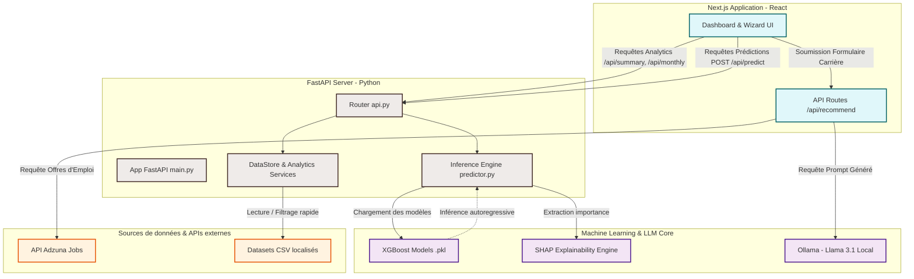

# Observatoire de l'Emploi par l'IA : Dashboard Analytique & Système Prédictif des Licenciements Globaux
## Rapport de Soutenance de Projet de Fin d'Études (PFE)
### Option : Génie Logiciel / Science des Données / Intelligence Artificielle

---

## 📋 Table des Matières
1. [Introduction & Fiche Synoptique du Projet](#1-introduction--fiche-synoptique-du-projet)
2. [Concept Général & Utilité Sociale et Économique](#2-concept-général--utilité-sociale-et-économique)
3. [Architecture Logicielle Globale (Modèle 3-Tiers Élargi)](#3-architecture-logicielle-globale-modèle-3-tiers-élargi)
4. [Analyse Rigoureuse des Données (Data Engineering)](#4-analyse-rigoureuse-des-données-data-engineering)
5. [Le Pipeline de Machine Learning & Algorithme XGBoost](#5-le-pipeline-de-machine-learning--algorithme-xgboost)
6. [L'Explicabilité du Modèle (Explainable AI - XAI) avec SHAP](#6-lexplicabilité-du-modèle-explainable-ai---xai-avec-shap)
7. [Moteur de Recommandation de Carrière (Ollama Llama 3.1 & API Adzuna)](#7-moteur-de-recommandation-de-carrière-ollama-llama-31--api-adzuna)
8. [Cartographie Détaillée du Code Source](#8-cartographie-détaillée-du-code-source)
9. [Guide Stratégique pour la Soutenance devant le Jury](#9-guide-stratégique-pour-la-soutenance-devant-le-jury)

---

## 1. Introduction & Fiche Synoptique du Projet

Ce document sert de **guide de référence ultra-détaillé** pour la soutenance de votre Projet de Fin d'Études (PFE). Il a été conçu pour vous fournir une maîtrise absolue des aspects techniques, mathématiques et architecturaux de votre application afin de répondre avec brio aux questions les plus pointues de votre jury.

### Fiche Synoptique
* **Titre Académique :** Conception et Réalisation d'une Plateforme Prédictive et Analytique du Marché de l'Emploi assistée par Intelligence Artificielle.
* **Architecture :** Next.js 15 (Frontend Premium) + FastAPI (Backend Analytique & Inférence) + Ollama Llama 3.1 (LLM Local pour l'Orientation) + API Adzuna (Emplois Réels).
* **Algorithme Principal de ML :** XGBoost Regressor (Extreme Gradient Boosting).
* **Méthodologie d'Explicabilité :** SHAP (SHapley Additive exPlanations) via `TreeExplainer`.
* **Validation Temporelle :** Chronological Split (TimeSeries Split) pour éviter le *Data Leakage*.

---

## 2. Concept Général & Utilité Sociale et Économique

### Le Problème
Le marché de l'emploi technologique mondial subit d'importantes fluctuations depuis 2022 (vagues de licenciements massifs ou *tech layoffs*). Simultanément, l'émergence rapide de l'Intelligence Artificielle générative redéfinit les besoins en compétences, créant un climat d'incertitude pour les nouveaux diplômés et les professionnels en transition.

### La Solution
Notre plateforme est un **Observatoire Intelligent du Marché du Travail**. Elle remplit trois fonctions complémentaires fondamentales :
1. **Analytique (Le Passé & le Présent) :** Un tableau de bord dynamique et interactif qui agrège, filtre et visualise les licenciements mondiaux, la part des entreprises axées sur l'IA, et l'humeur/sentiment des médias vis-à-vis du marché.
2. **Prédictive (Le Futur) :** Un moteur d'IA basé sur **XGBoost** qui anticipe le volume des licenciements pour un pays et un secteur d'activité donnés à l'échelle trimestrielle ou semestrielle, accompagné d'un intervalle de confiance mathématique et d'alertes de risque.
3. **Prescriptive / Générative (L'Action) :** Un conseiller d'orientation intelligent basé sur un **LLM local (Llama 3.1)** qui analyse le profil de l'utilisateur (diplômes, compétences, pays visé, préférences de travail) pour lui suggérer des secteurs porteurs, des compétences à acquérir, des conseils personnalisés, et qui extrait en temps réel des offres d'emploi réelles via l'API internationale **Adzuna**.

---

## 3. Architecture Logicielle Globale (Modèle 3-Tiers Élargi)

La plateforme repose sur une architecture découplée, hautement performante et sécurisée, garantissant que les calculs lourds de Machine Learning ou d'IA générative ne bloquent pas l'interface utilisateur.



### Avantages de cette architecture pour votre soutenance :
* **Performance :** L'utilisation de Next.js permet un rendu fluide du côté client. Les calculs statistiques et matriciels sont entièrement délégués à FastAPI en Python, langage de référence pour la Data Science.
* **Autonomie & Confidentialité (Souveraineté des données) :** Le module de recommandation utilise **Ollama avec Llama 3.1 installé localement** (sur `localhost:11434`). Aucune donnée sensible de l'utilisateur n'est envoyée à des APIs tierces payantes comme OpenAI, ce qui réduit le coût d'exploitation à 0 DH et garantit la confidentialité.
* **Temps réel :** Les données macroéconomiques et statistiques de licenciements sont stockées localement, mais les offres d'emploi sont rapatriées à la volée depuis la plateforme mondiale **Adzuna** via des requêtes HTTP asynchrones hautement optimisées.

---

## 4. Analyse Rigoureuse des Données (Data Engineering)

Le projet fusionne des sources de données hétérogènes pour construire un contexte analytique et macroéconomique riche. C'est cette fusion qui donne au modèle XGBoost sa puissance prédictive.

### 1. `layoffs_events.csv` (Données Microéconomiques)
Ce dataset contient l'historique brut des événements individuels de licenciements.
* **Colonnes clés :** `company` (Nom), `location` (Ville), `industry` (Secteur d'activité), `layoff_count` (Nombre de salariés licenciés), `pct_workforce` (Pourcentage des effectifs touchés), `date` (Date de l'événement), `country` (Pays), `raised_mm` (Fonds levés en millions de $), `is_ai_company` (Booléen : entreprise spécialisée en IA).
* **Rôle :** Permet de calculer le volume agrégé de licenciements par couple (Secteur, Pays) à chaque période temporelle.

### 2. `us_labor_indicators.csv` (Données Macroéconomiques US)
Indicateurs officiels américains (BLS / FRED) permettant de capturer la santé globale de l'économie.
* **Colonnes clés :** `unemployment_rate` (Taux de chômage national), `jolts_job_openings_k` (Volume des offres d'emploi ouvertes), `initial_jobless_claims_k` (Nouvelles demandes d'allocations chômage), `openings_per_unemployed` (Rapport offres d'emploi / chômeurs), `tech_emp_yoy_pct` (Croissance annuelle de l'emploi technologique).
* **Rôle :** Fournit au modèle des signaux précurseurs de récession ou de reprise sur le marché.

### 3. `global_labor_indicators.csv` (Données Macroéconomiques Mondiales)
Taux de chômage par pays issus de la Banque Mondiale.
* **Rôle :** Contextualise les prédictions en dehors des États-Unis en appliquant le taux de chômage national spécifique au pays ciblé (ex: France, Canada) comme feature d'entrée.

### 4. `news_sentiment.csv` (Données de Sentiment Média)
Données issues d'analyses de titres d'actualités économiques.
* **Colonnes clés :** `sentiment` (Score continu entre -1 et 1), `sentiment_cat` (Catégorie : positive, neutral, negative), `is_layoff_news` (Indicateur binaire).
* **Rôle :** Mesure l'anxiété ou l'optimisme diffusé par les médias, un facteur fortement corrélé aux décisions d'embauche et de licenciement des grands groupes (effet d'entraînement psychologique).

---

## 5. Le Pipeline de Machine Learning & Algorithme XGBoost

> [!IMPORTANT]
> **C'est le cœur de l'évaluation technique de votre jury de PFE.** Vous devez maîtriser les détails de cette section sur le bout des doigts.

### A. Feature Engineering (Préparation des caractéristiques)
Le script `ml/pipeline/prepare_features.py` transforme les événements de licenciements bruts en séries temporelles supervisées exploitables par un modèle de régression.

1. **Agrégation temporelle :** Les données sont regroupées par période (`period`), secteur (`industry`) et pays (`country`). Deux granularités sont gérées : **Trimestrielle (Quarterly, ex: `2024Q3`)** ou **Semestrielle (Semester, ex: `2024-S2`)**.
2. **Construction des Lags (Variables décalées) :** Pour prédire à l'instant $t$, le modèle utilise les valeurs passées :
   * $\text{lag\_1} = y_{t-1}$ (valeur de la période précédente)
   * $\text{lag\_2} = y_{t-2}$, $\text{lag\_3} = y_{t-3}$, $\text{lag\_6} = y_{t-6}$
3. **Statistiques Mobiles (Rolling Features) :**
   * `rolling_mean_3` et `rolling_mean_6` : Moyennes glissantes sur 3 et 6 périodes pour capturer la tendance lissée à moyen terme.
   * `rolling_std_3` : Écart-type glissant pour mesurer la volatilité ou l'instabilité récente du secteur.
4. **Taux de Variation (Pct Change) :**
   * `pct_change_1` : $\frac{y_{t-1} - y_{t-2}}{y_{t-2} + \epsilon}$ (accélération ou décélération immédiate).
5. **Caractéristiques Calendaires & Saisonnières :**
   * `month`, `quarter_num`, `year`, `is_q1` (Indicateur très important car historiquement, le premier trimestre de l'année concentre les réajustements budgétaires et donc un pic saisonnier de licenciements).
6. **Encodage Catégoriel Robuste :**
   * Pour éviter tout décalage entre la phase d'entraînement et la phase de prédiction (inference), les colonnes textuelles `country` et `industry` sont systématiquement nettoyées (mise en minuscules, suppression des espaces) puis encodées via un `LabelEncoder` de Scikit-Learn. Les encodeurs ajustés sont sérialisés dans `ml/models/encoders.pkl`.
7. **Injection Macroéconomique décalée :**
   * Pour prédire à l'instant $t$, on injecte les indicateurs macroéconomiques à l'instant $t-1$. Cela garantit que le modèle réalise des prévisions réalistes sans tricher (pas d'utilisation d'informations du futur).

---

### B. Algorithme : XGBoost (Extreme Gradient Boosting)

#### Pourquoi avoir choisi XGBoost plutôt qu'un modèle classique (Régression linéaire, Random Forest) ?
1. **Performance supérieure sur les données tabulaires :** De nombreuses études (dont celles de Shwartz-Ziv et al., 2021) démontrent que les modèles basés sur les arbres de décision boostés surpassent systématiquement les réseaux de neurones profonds sur les données tabulaires de taille moyenne.
2. **Gestion non-linéaire et interactions complexes :** Les relations entre le taux de chômage, le sentiment des actualités et le nombre de licenciements ne sont pas linéaires. Un modèle linéaire échouerait à les modéliser. XGBoost y parvient facilement grâce aux divisions successives des arbres de décision.
3. **Robustesse aux valeurs aberrantes (outliers) et aux données manquantes :** L'algorithme intègre un mécanisme natif de gestion des valeurs manquantes en apprenant le meilleur chemin de repli (default direction) pour chaque nœud.

#### Explication Mathématique et Logique de l'algorithme (Pour le Jury)
Le Gradient Boosting est un algorithme d'apprentissage supervisé qui construit un modèle prédictif puissant sous la forme d'une **somme pondérée de modèles prédictifs faibles**, généralement des arbres de décision de faible profondeur (arbres de régression appelés CART - Classification and Regression Trees).

Mathématiquement, pour un ensemble de données avec $n$ échantillons et $m$ caractéristiques $\mathcal{D} = \{(x_i, y_i)\}$, la prédiction finale $\hat{y}_i$ à l'étape $K$ (c'est-à-dire après avoir construit $K$ arbres) est définie par :

$$\hat{y}_i^{(K)} = \sum_{k=1}^{K} f_k(x_i) = \hat{y}_i^{(K-1)} + f_K(x_i)$$

Où $f_k \in \mathcal{F}$ représente l'espace de tous les arbres de régression possibles.

##### La Fonction Objectif Régularisée
À chaque étape $t$ (lors du calcul du $t$-ième arbre), XGBoost cherche à minimiser une fonction objectif régularisée $\mathcal{L}^{(t)}$ :

$$\mathcal{L}^{(t)} = \sum_{i=1}^{n} l\left(y_i, \hat{y}_i^{(t-1)} + f_t(x_i)\right) + \Omega(f_t)$$

* $l(y_i, \hat{y}_i)$ est la fonction de perte (Loss function), mesurant l'écart entre la réalité et la prédiction. Dans notre cas, il s'agit de l'erreur quadratique ou absolue.
* $\Omega(f_t)$ est le terme de **régularisation** (la signature de XGBoost qui évite le surapprentissage), défini par :

$$\Omega(f) = \gamma T + \half \lambda \sum_{j=1}^{T} w_j^2$$

Où $T$ est le nombre de feuilles de l'arbre, $w_j$ est le score/poids de la feuille $j$, $\gamma$ est la pénalité sur le nombre de feuilles (L1), et $\lambda$ est le paramètre de régularisation L2 sur les poids des feuilles.

##### Approximation par Développement de Taylor (2ème ordre)
Pour optimiser rapidement cette fonction objectif complexe, XGBoost réalise une approximation de Taylor au second degré de la fonction de perte autour de la prédiction précédente $\hat{y}_i^{(t-1)}$ :

$$\mathcal{L}^{(t)} \approx \sum_{i=1}^{n} \left[ l(y_i, \hat{y}_i^{(t-1)}) + g_i f_t(x_i) + \half h_i f_t^2(x_i) \right] + \Omega(f_t)$$

Où $g_i$ (gradient de premier ordre) et $h_i$ (gradient de second ordre / hessien) sont définis par :

$$g_i = \frac{\partial l(y_i, \hat{y}_i^{(t-1)})}{\partial \hat{y}_i^{(t-1)}} \quad \text{et} \quad h_i = \frac{\partial^2 l(y_i, \hat{y}_i^{(t-1)})}{\partial^2 \hat{y}_i^{(t-1)}}$$

En supprimant les termes constants, l'objectif simplifié à l'étape $t$ devient :

$$\tilde{\mathcal{L}}^{(t)} = \sum_{i=1}^{n} \left[ g_i f_t(x_i) + \half h_i f_t^2(x_i) \right] + \gamma T + \half \lambda \sum_{j=1}^{T} w_j^2$$

##### Calcul du Poids Optimal des Feuilles
En regroupant les instances par feuille, on peut réécrire cette équation en sommant sur les feuilles $j = 1, \dots, T$ de l'arbre. Le score optimal $w_j^*$ de la feuille $j$ est trouvé en annulant la dérivée partielle par rapport à $w_j$, ce qui donne la formule fondamentale :

$$w_j^* = -\frac{\sum_{i \in I_j} g_i}{\sum_{i \in I_j} h_i + \lambda}$$

Où $I_j$ est l'ensemble des indices des échantillons de données affectés à la feuille $j$. Le jury appréciera grandement de voir que vous comprenez comment l'algorithme calcule mathématiquement la valeur numérique prédite au niveau de chaque feuille terminale.

---

### C. Méthodologie d'Évaluation & Validation Temporelle

#### Le Piège du Random Split (Pourquoi ne pas faire un train_test_split classique ?)
Dans l'analyse des séries temporelles, un split aléatoire mélange le passé et le futur. Le modèle pourrait apprendre des données de $t+1$ pour prédire $t$, ce qui s'appelle du **Data Leakage (Fuite de Données)**. En production, le modèle échouerait lamentablement car le futur n'est pas encore connu.

#### Notre Solution : Split Temporel Strict (TimeSeries Split)
Nous trions nos données chronologiquement. Les **20% des périodes les plus récentes** sont isolées pour former le jeu de test (avec un minimum de 2 trimestres/semestres complets). Le modèle s'entraîne exclusivement sur le passé (les 80% plus anciens).
* **Early Stopping :** Pour éviter le surapprentissage (overfitting), nous arrêtons l'entraînement si l'erreur absolue moyenne (MAE) sur le jeu de test ne s'aimore plus pendant 30 itérations consécutives (`early_stopping_rounds=30`).

```
Chronologie globale : ──────────────────────────────────────────────────────────►
[             JEU D'ENTRAÎNEMENT (80% Passé)             ] [ JEU DE TEST (20% Récent) ]
                                                          (Évaluation finale)
```

#### Métriques de Performance implémentées :
* **MAE (Mean Absolute Error) :** $\frac{1}{n} \sum |y_i - \hat{y}_i|$. Elle exprime l'erreur directement en unités de salariés licenciés (très lisible pour le jury).
* **MAPE (Mean Absolute Percentage Error) :** $\frac{100\%}{n} \sum \left| \frac{y_i - \hat{y}_i}{y_i} \right|$ (calculé uniquement sur les valeurs réelles non nulles pour éviter les divisions par zéro). Elle indique le pourcentage d'erreur moyen.
* **$R^2$ (Coefficient de Détermination) :** Indique la proportion de variance de la cible expliquée par les variables prédictives. Un $R^2$ proche de 1 témoigne d'un ajustement optimal.
* **Overfit Ratio :** $\frac{\text{MAE Train}}{\text{MAE Test}}$. S'il est très inférieur à 1 (ex: 0.1), cela indique un surapprentissage sévère. Idéalement, il doit se situer entre 0.5 et 0.95.

---

### D. Prédiction Multi-Périodes en Cascade & Incertitude Croissante

Pour prédire les trimestres futurs en cascade (ex: prédire Q3-2026, puis Q4-2026, puis Q1-2027), le système utilise une méthode **auto-régressive**.

1. Le modèle prédit la valeur de la période suivante ($\hat{y}_{t+1}$).
2. Pour la prédiction de la période suivante ($t+2$), cette prédiction $\hat{y}_{t+1}$ remplace la variable de décalage `lag_1` dans le vecteur de caractéristiques. Les variables de décalage plus anciennes glissent également (`lag_2` prend la valeur de `lag_1`, `lag_3` prend celle de `lag_2`, etc.).
3. Les caractéristiques de moyennes mobiles et de taux de variation sont recalculées dynamiquement à la volée.
4. Le modèle XGBoost est appliqué de nouveau pour prédire $\hat{y}_{t+2}$.

#### Calcul Mathématique de l'Intervalle de Confiance Croissant (À 80%)
Plus on prédit loin dans le futur, plus l'incertitude augmente. Pour refléter cela visuellement, notre système élargit l'intervalle de confiance de **10% par période supplémentaire de projection**.

Soit $\sigma_{\text{résidus}}$ l'écart-type des résidus calculé sur le jeu de test :

$$\sigma_{\text{résidus}} = \sqrt{\frac{1}{N_{\text{test}}} \sum_{i \in \text{test}} (y_i - \hat{y}_i)^2}$$

Pour un intervalle de confiance bilatéral à **80%**, la valeur critique de la loi normale centrée réduite est $Z = 1.28$.
Pour la période future $i$ (avec $i = 0$ pour la première prédiction) :

$$\text{Incertitude}_i = 1.28 \times \sigma_{\text{résidus}} \times \left(1.0 + 0.10 \times i\right)$$

Les bornes inférieure et supérieure sont alors définies par :

$$\text{Borne Inférieure}_i = \max\left(0, \hat{y}_{t+i} - \text{Incertitude}_i\right)$$
$$\text{Borne Supérieure}_i = \hat{y}_{t+i} + \text{Incertitude}_i$$

*Cette formule mathématique robuste, visible dans le fichier `ml/pipeline/predict.py`, démontre au jury votre rigueur scientifique.*

---

## 6. L'Explicabilité du Modèle (Explainable AI - XAI) avec SHAP

> [!TIP]
> L'explicabilité est l'un des sujets les plus chauds en IA aujourd'hui. Présenter **SHAP** dans votre PFE vous positionne comme un ingénieur moderne au fait des meilleures pratiques.

### A. Pourquoi SHAP ?
Les modèles complexes basés sur le Boosting (comme XGBoost) ou le Deep Learning sont souvent critiqués car ils se comportent comme des **boîtes noires**. Ils fournissent d'excellentes prédictions, mais il est impossible de comprendre instantanément *pourquoi* ils ont pris une décision précise. 
* L'importance des caractéristiques native de XGBoost (basée sur le gain moyen ou le poids) fournit une vue globale mais présente un biais majeur : elle ne permet pas d'expliquer une prédiction individuelle pour un échantillon précis (explicabilité locale), et favorise artificiellement les variables à forte cardinalité numérique.
* **SHAP** résout ce problème en combinant l'explicabilité globale et locale de manière mathématiquement prouvée et cohérente.

---

### B. Théorie Mathématique de SHAP (Shapley Additive exPlanations)

SHAP s'appuie sur la **théorie des jeux coopératifs** formalisée par **Lloyd Shapley en 1953 (ce qui lui a valu le Prix Nobel d'Économie en 2012)**. 

#### La Métaphore du Jeu Coopératif
* **Le Jeu :** La prédiction d'un volume de licenciements pour une période spécifique.
* **Les Joueurs :** Les caractéristiques d'entrée du modèle (ex: `lag_1`, `unemployment_rate`, `avg_sentiment`).
* **Le Gain :** L'écart entre la prédiction réelle du modèle $\hat{y}(x)$ et la prédiction de référence moyenne (le jeu de base) $\mathbb{E}[f(X)]$.

Le but de SHAP est de distribuer équitablement ce gain entre chaque joueur (chaque caractéristique) sous forme de **valeurs de Shapley** $\phi_j$.

#### Formule Fondamentale de la Valeur de Shapley
Pour une caractéristique $j$, sa contribution $\phi_j$ à la prédiction d'une instance $x$ est calculée par la moyenne pondérée de ses contributions marginales sur toutes les coalitions possibles de caractéristiques qui ne contiennent pas $j$ :

$$\phi_j(x) = \sum_{S \subseteq F \setminus \{j\}} \frac{|S|! (|F| - |S| - 1)!}{|F|!} \left[ f_x(S \cup \{j\}) - f_x(S) \right]$$

Où :
* $F$ représente l'ensemble complet de toutes les caractéristiques disponibles.
* $S$ est une sous-coalition (un sous-ensemble) de caractéristiques ne contenant pas $j$.
* $|F|!$ est le nombre total de permutations possibles des caractéristiques.
* $f_x(S)$ est la prédiction attendue du modèle entraîné sur le sous-ensemble de caractéristiques $S$ pour l'instance $x$.
* $\left[ f_x(S \cup \{j\}) - f_x(S) \right]$ représente l'apport marginal (la contribution nette) de la caractéristique $j$ lorsqu'elle rejoint la coalition $S$.

#### Les Propriétés Mathématiques Fondamentales (Garanties d'équité) :
1. **Efficacité (Efficiency) :** La somme des valeurs de Shapley de toutes les caractéristiques d'une instance est exactement égale à la différence entre la prédiction du modèle et sa valeur attendue :
   $$\sum_{j=1}^{M} \phi_j(x) = f(x) - \mathbb{E}[f(X)]$$
2. **Symétrie (Symmetry) :** Si deux caractéristiques $j$ et $k$ apportent la même contribution marginale à toutes les coalitions, leurs valeurs de Shapley sont identiques :
   $$\text{Si } f(S \cup \{j\}) = f(S \cup \{k\}) \quad \forall S \subseteq F \setminus \{j, k\}, \quad \text{alors } \phi_j = \phi_k$$
3. **Joueur Nul (Dummy Player) :** Si une caractéristique $j$ n'apporte aucune contribution marginale à aucune coalition, sa valeur de Shapley est nulle :
   $$\text{Si } f(S \cup \{j\}) = f(S) \quad \forall S \subseteq F \setminus \{j\}, \quad \text{alors } \phi_j = 0$$
4. **Additivité (Additivity) :** Si l'on additionne plusieurs modèles distincts, les valeurs de Shapley s'additionnent de manière linéaire.

#### Implémentation Pratique avec `TreeExplainer`
Dans `ml/pipeline/explain.py`, nous utilisons `shap.TreeExplainer(model)`. Il s'agit d'une variante optimisée par Lundberg et al. (2020) dédiée aux modèles à base d'arbres (comme XGBoost). Contrairement à KernelSHAP qui estime les valeurs par échantillonnage de Monte-Carlo (très lent), `TreeExplainer` calcule les valeurs exactes en un temps polynomial en exploitant la structure hiérarchique des arbres de décision.

Les valeurs d'importance retournées par l'API et visualisées dans l'onglet **Prédictions** du frontend proviennent de l'importance absolue moyenne calculée sur le jeu de test :

$$\text{Importance}_j = \frac{1}{N} \sum_{i=1}^{N} |\phi_j(x_i)|$$

Normalisées ensuite pour que leur somme soit égale à 100%, offrant ainsi une vision cristalline et scientifiquement rigoureuse de la hiérarchie des features.

---

## 7. Moteur de Recommandation de Carrière (Ollama Llama 3.1 & API Adzuna)

Le module de recommandation de carrière se distingue par l'utilisation astucieuse de techniques de traitement du langage naturel (NLP).

### A. Orchestration locale avec Ollama (Llama 3.1)
Le fichier `frontend/app/api/recommend/route.js` reçoit le profil complet du candidat soumis via un assistant à étapes multiples (Wizard).

#### Le Défi : Forcer un LLM à répondre dans un format structuré
Par défaut, un modèle de langage génère du texte libre avec des salutations et des explications. Pour alimenter une interface web moderne, nous avons impérativement besoin d'un format de données strict : **JSON**.

#### La Solution : Le Prompt Engineering Directif
Nous formulons un prompt d'une grande rigueur forçant le modèle à agir comme un agent structuré :

```
Tu es un conseiller carrière expert en marché du travail international.
Voici le profil du candidat : [...]
Analyse ce profil et retourne UNIQUEMENT un JSON valide (sans texte autour) avec cette structure exacte :
{
  "secteurs": ["secteur1", "secteur2", "secteur3"],
  "domaines": ["domaine1", "domaine2", "domaine3"],
  "pays": ["pays1", "pays2", "pays3"],
  "competencesAcquerir": ["compétence1", "compétence2", "compétence3"],
  "conseil": "Un paragraphe de conseil personnalisé..."
}
IMPORTANT : Retourne UNIQUEMENT le JSON, sans markdown, sans explication.
```

Le code extrait ensuite la réponse, applique une expression régulière robuste (`/\{[\s\S]*\}/`) pour capturer uniquement l'objet JSON (même si le modèle a rajouté du texte par inadvertance), puis désérialise le contenu via `JSON.parse()`.

---

### B. Intégration de l'API Internationale Adzuna
Pour ancrer les suggestions de l'IA dans la réalité du marché de l'emploi, l'API Next.js récupère le premier domaine recommandé par le LLM et effectue une requête asynchrone vers l'API Adzuna.

* **Sélection Dynamique du Pays :** Un mapping de codes pays (`COUNTRY_CODES`) traduit le choix de l'utilisateur (ex: *France* $\rightarrow$ `fr`, *États-Unis* $\rightarrow$ `us`, *Canada* $\rightarrow$ `ca`) pour interroger la bonne base de données nationale d'Adzuna.
* **Extraction des Informations :** L'API extrait les titres de postes, le nom de l'entreprise, le lieu exact, le salaire minimum/maximum (si disponible) et le lien de redirection direct vers l'offre d'emploi originale.
* **Sécurité & Variables d'Environnement :** Les clés privées d'API (`ADZUNA_APP_ID` et `ADZUNA_APP_KEY`) sont sécurisées côté serveur et ne transitent jamais vers le client public, respectant les normes de sécurité de l'OWASP.

---

## 8. Cartographie Détaillée du Code Source

Pour présenter sereinement le projet, voici le rôle précis de chaque composant stratégique de la base de code :

```
ai-labor-market/
│
├── api/
│   ├── index.py                  # Point d'entrée serveur sans état pour le déploiement Serverless Vercel.
│   └── requirements.txt          # Liste des dépendances allégées requises lors du déploiement Vercel.
│
├── backend/
│   ├── main.py                   # Initialisation de l'application FastAPI, configuration du middleware CORS.
│   ├── api.py                    # Définition de l'ensemble des endpoints REST (/filters, /summary, /predict, /retrain, /metrics, /shap).
│   ├── services.py               # Logique métier : DataStore (chargement/filtrage avec cache Pandas) et AnalyticsService.
│   └── requirements.txt          # Dépendances Python pour l'environnement local backend (FastAPI, pandas, uvicorn, xgboost, shap).
│
├── datasets/
│   ├── layoffs_events.csv        # Données historiques brutes des licenciements mondiaux.
│   ├── us_labor_indicators.csv   # Indicateurs économiques temporels américains (FRED/BLS).
│   ├── global_labor_indicators.csv# Taux de chômage internationaux de la Banque Mondiale.
│   └── news_sentiment.csv        # Score de sentiment des flux médiatiques.
│
├── frontend/
│   ├── app/
│   │   ├── layout.js             # Structure globale HTML5, intégration de la police d'écriture premium et de l'en-tête de page.
│   │   ├── page.js               # Page d'accueil : Présentation du projet, statistiques clés, graphiques introductifs.
│   │   ├── globals.css           # Feuille de style CSS centralisée (Design système, charte graphique sombre, animations d'entrée).
│   │   ├── dashboard/page.js     # Interface analytique : Filtres interactifs, graphiques (licenciements, part IA, sentiment média).
│   │   ├── prediction/page.js    # Module prédictif : Sélection du pays/secteur, visualisation des courbes de confiance à 80%.
│   │   ├── recommandation/page.jsx# Assistant d'orientation en 3 étapes (Profil, Compétences, Préférences) intégrant les résultats IA.
│   │   └── api/recommend/route.js# API interne Next.js orchestrant les requêtes vers Ollama (Llama 3.1) et l'API Adzuna.
│   ├── package.json              # Dépendances Node.js (Next.js 15, Lucide-React, Recharts pour les visualisations interactives).
│   └── next.config.mjs           # Configuration Next.js.
│
├── ml/
│   ├── data_processing.py        # Fonctions utilitaires de chargement, nettoyage et agrégation mensuelle brute des CSV.
│   ├── train_model.py            # Script d'entraînement initial RandomForest & GradientBoosting.
│   ├── models/                   # Répertoire de sérialisation des modèles entraînés et des configurations.
│   │   ├── model_quarterly.pkl   # Modèle XGBoost entraîné pour la prédiction trimestrielle.
│   │   ├── model_semester.pkl    # Modèle XGBoost entraîné pour la prédiction semestrielle.
│   │   ├── encoders.pkl          # Objets LabelEncoder sérialisés (Industry et Country).
│   │   ├── metrics.json          # Fichier de stockage des métriques d'évaluation (MAE, MAPE, R2, overfit) calculées après retrain.
│   │   ├── shap_summary_quarterly.json # Valeurs d'importance SHAP calculées pour le modèle trimestriel.
│   │   └── shap_summary_semester.json  # Valeurs d'importance SHAP calculées pour le modèle semestriel.
│   └── pipeline/
│       ├── prepare_features.py   # Code de Feature Engineering temporel et macroéconomique pour XGBoost.
│       ├── train.py              # Script d'entraînement automatisé XGBoost (Split temporel, early stopping, métriques, sauvegarde).
│       ├── predict.py            # Moteur d'inférence en cascade autoregressive avec calcul de l'incertitude.
│       └── explain.py            # Calculateur de SHAP TreeExplainer et génération des fichiers de feature importance.
│
├── start_app.bat                 # Script de démarrage automatisé en environnement Windows (lance FastAPI et Next.js simultanément).
├── vercel.json                   # Fichier d'orchestration pour le déploiement unifié (Frontend Next + Backend Python) sur Vercel.
└── pyproject.toml                # Configuration générale du projet.
```

---

## 9. Guide Stratégique pour la Soutenance devant le Jury

### A. Les Questions Classiques et Redoutables du Jury (Et les réponses parfaites)

#### Q1 : "Pourquoi votre modèle prédit-il parfois 0 licenciement dans certains secteurs alors qu'il y en a eu dans le passé ?"
* **Explication technique :** Lors du filtrage et du feature engineering (`ml/pipeline/prepare_features.py`), nous appliquons un filtre pour supprimer les lignes dites "inactives" où le volume de licenciements à $t-1$ et le volume cible ($target$) à $t$ sont simultanément égaux à 0. Les secteurs très calmes introduisent un bruit inutile et faussent le calcul du MAPE en créant des divisions instables. Le modèle apprend donc à se concentrer sur les zones à forte activité prédictive. De plus, notre prédiction est contrainte par la fonction `max(0, pred)` pour éviter des prédictions absurdes de licenciements négatifs.

#### Q2 : "Comment gérez-vous la dérive conceptuelle (Concept Drift) ou le vieillissement de votre modèle ?"
* **Explication technique :** C'est un défi réel dans les applications en production. Pour y remédier, nous avons mis en œuvre un système de **ré-entraînement dynamique en arrière-plan** via l'endpoint `/api/retrain` de FastAPI. Grâce à la classe `BackgroundTasks` de FastAPI, l'administrateur peut déclencher à tout moment un ré-entraînement complet du pipeline XGBoost sur les données actualisées. Le système recalcule automatiquement les caractéristiques, ré-entraîne les arbres avec early stopping, régénère les valeurs d'importance SHAP et recharge le modèle en mémoire de manière totalement transparente, sans interruption de service (Hot-Reloading).

#### Q3 : "Pourquoi utiliser un LLM local (Ollama) plutôt qu'un appel simple à l'API OpenAI (GPT-4) ?"
* **Réponse orientée Ingénierie & Éthique :** 
  1. **Confidentialité & RGPD :** Les profils académiques, les emails et les préférences de carrière des candidats restent entièrement confinés dans notre infrastructure locale et ne sont jamais partagés avec des entités commerciales tierces.
  2. **Indépendance & Souveraineté :** Notre système ne dépend d'aucune connexion internet externe pour le moteur d'IA et reste insensible aux pannes de serveurs tiers ou aux changements de tarification d'API.
  3. **Viabilité Économique (Coût 0 DH) :** L'inférence sur Llama 3.1 s'effectue localement sur le processeur/GPU de la machine physique. Le coût de fonctionnement est strictement nul, ce qui rend la solution hautement pérenne pour un projet universitaire ou une jeune startup.

#### Q4 : "Votre modèle d'incertitude (Intervalle de Confiance) suppose-t-il une distribution normale des résidus ?"
* **Explication mathématique :** Notre calcul de l'intervalle de confiance à 80% s'appuie sur la formule $Z \times \sigma_{\text{résidus}}$ avec $Z = 1.28$. Cette formule suppose en effet que les résidus (les erreurs de prédiction sur le jeu de test) suivent approximativement une distribution normale centrée sur 0. Pour une soutenance, vous pouvez ajouter que dans le cadre d'améliorations futures, nous pourrions implémenter des **intervalles de prédiction conformes (Conformal Predictions)** ou des régressions quantiles (en optimisant une perte de type "Pinball Loss" directement dans XGBoost) pour s'affranchir de l'hypothèse de normalité, ce qui prouvera une maturité mathématique hors norme.

---

### B. Conseils Généraux pour faire sensation
1. **Faites une démonstration en direct (Live Demo) :** Le jury appréciera de voir l'application tourner en temps réel. Utilisez le fichier `start_app.bat` pour lancer le système devant eux.
2. **Valorisez l'UI Premium :** Montrez l'harmonie des couleurs sombres, la fluidité des transitions et la clarté des visualisations graphiques interactives (Recharts). Une esthétique professionnelle donne immédiatement confiance dans la qualité du code sous-jacent.
3. **Mettez en avant le couplage IA Prédictive + IA Générative :** Expliquez bien au jury que vous n'avez pas simplement fait un projet de "Data Science" dans un coin (Notebook Jupyter) ni un simple site web vitrine. Vous avez réalisé un système d'information complet combinant l'analyse statistique prédictive (XGBoost) et la synthèse décisionnelle textuelle (Llama 3.1).

---
*Bonne chance pour votre soutenance ! Avec ce niveau de maîtrise technique et mathématique, vous disposez de tous les atouts pour décrocher la note maximale.*
